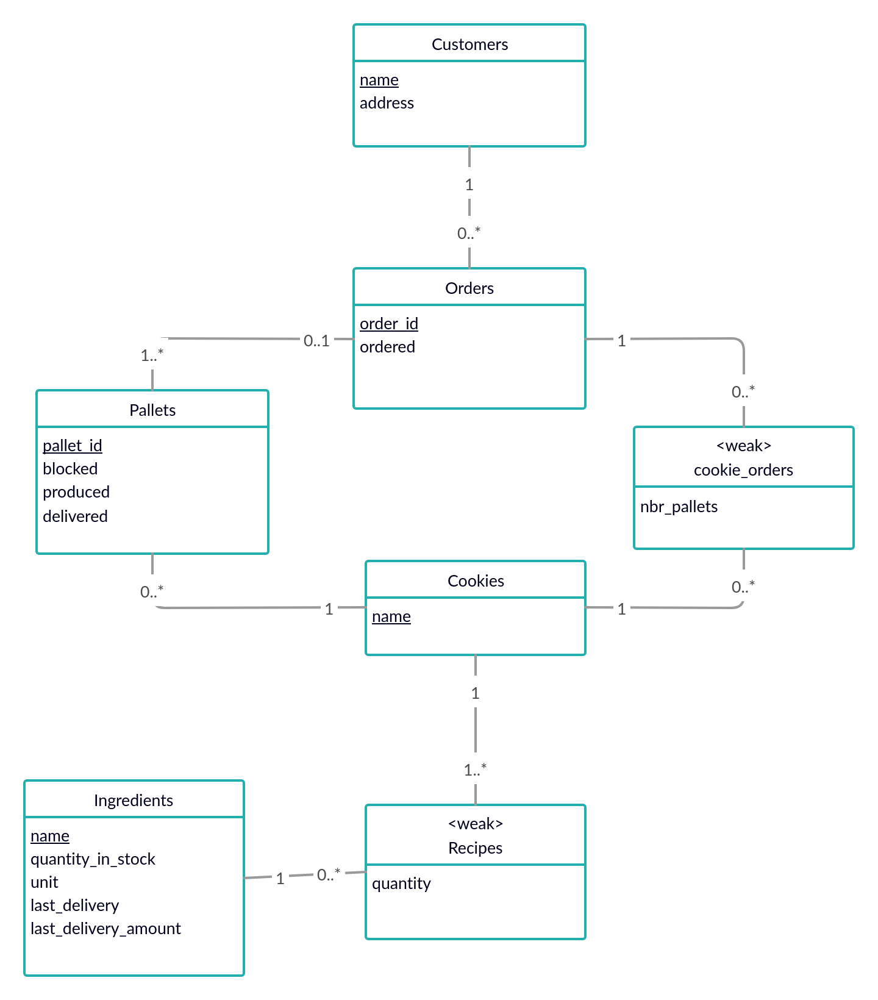

# EDAF75, project report

This is the report for

 + Edvin Andersson, `elt15ean`
 + Direa Osman `atf10dos`

We solved this project on our own.

## ER-design

The model is in the file [`UML.png`](UML.png):

<center>
    
</center>

## Relations

+ ingredients(**name**, quantity_ in_stock, unit, delivery, last_ delivery_amount)
+ recipes(**_ingredient_**, **_cookie_**, quantity)
+ cookies(**name**)
+ pallets(**pallet_id**, _order_id_, _cookie_, blocked, produced, delivered)
+ orders(**order_id**, _name_, order_status, ordered)
+ cookie_orders(**_order_id_**, **_cookie_**, nbr_pallets)
+ customers(**name**, adress)

## Scripts

The script used to set up the database is in:

[`create-schema.sql`](create-schema.sql)

To create the database we run:

```shell
sqlite3 krusty-db.sqlite < create-schema.sql
```

## Running the server

To start the server we run:

```shell
python krusty-server.py
```